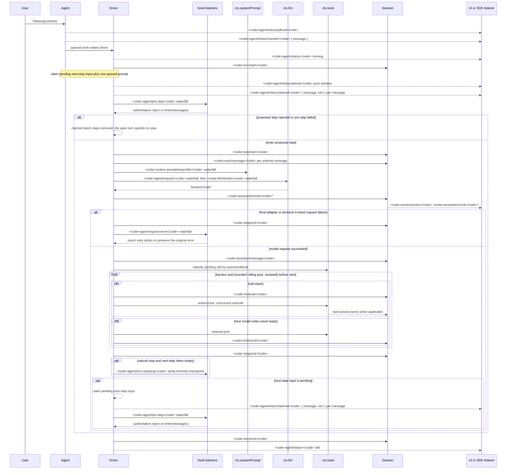

<!-- Generated by scripts/gen-doc-graphs.ts - do not edit by hand.
     Run `pnpm run gen-doc-graphs` to regenerate. -->

# AgentのTurnとStepのライフサイクル

[English](agent-lifecycle.md) | [中文](agent-lifecycle.zh.md) | 日本語

このシーケンスは[architecture.md](architecture.md#turn-flow)の視覚的な補足です。永続的なリプレイ事実を`session/event`に、実行中の制御と状態を`agent/*`に保持します。

`assistant/message`イベントは、コンテンツなしや`max-tokens`での終了を含む、成功したすべてのプロバイダー呼び出しを記録します。空のコンテンツは派生履歴には含めませんが、永続イベントは使用量と、正確な`assistant/chunk`イベントを列挙する`sourceEventSeqs`を保持します。明示的な空リストも保持します。

`dsh-compaction-basic`は、リクエストを導出する前の負荷に`agent/pre-step`を使い、正規のコンテキストオーバーフローにだけ`agent/request-error`を使います。どちらかのトリガーが条件を満たすと、要約選択の前に任意のツール結果刈り込みを実行します。復旧は失敗したstepの終了後から失敗したturnの終了までの間に行われ、刈り込みまたは要約によってsurface置換世代が進んだ場合だけ新しいリトライturnを開始します。それ以外では元のリクエストエラーが正となります。

返された`agent/pre-step`の判断が正となります。`next()`をラップするリスナーは、意図的な置換でない限り下流のメッセージを保持します。steeringと注入されたコンテキストは、後続のclaim操作が次のstepのバッチを取得した後、同じwaterfallを通ります。

リプレイ可能なtranscriptデータが必要なSDK利用者は`session/event`を利用してください。`agent/*`はキュー／状態、プロンプトのインターセプト、リクエスト構築、steering、継続、エラーのための実行中調整APIです。

メンテナンスモード：管理されたMermaidシーケンス。正確なイベントシグネチャは生成されたCordisカタログにあります。
