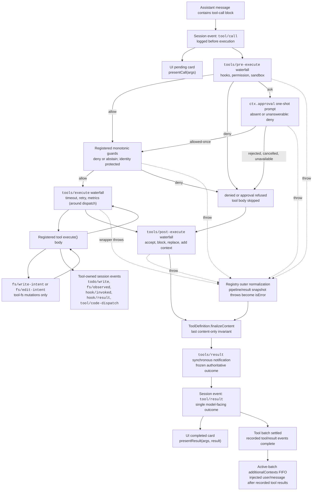

<!-- Generated by scripts/gen-doc-graphs.ts - do not edit by hand.
     Run `pnpm run gen-doc-graphs` to regenerate. -->

# ツール実行パイプライン

[English](tool-execution-pipeline.md) | [中文](tool-execution-pipeline.zh.md) | 日本語

このグラフは、ループを変更せずにポリシー、フック、サンドボックス化、ファイルシステムガード、結果の書き換え、最終結果の観測、UIレンダリングがどこで実行されるかを示します。最初に`tools/pre-execute` waterfallが実行され、次に単調ガードが実行され、その後に`tools/execute`と`tools/post-execute` waterfallが続きます。3つのwaterfallは呼び出しを変換できます。その後、定義が所有する`finalizeContent`と`tools/result`が実行されます。

ファイルシステムの読み取り前編集チェックは、`fs/*`イベント上で`tool-fs`より下に留まります。汎用のpre／post waterfallはフックと承認ポリシーを受け持ちます。`ctx.approval`は単調ガードの前に確認要求を解決し、順序を変えてはいけない所有者ポリシーは登録済みガードとして残ります。タイムアウトなどaroundディスパッチの関心事は`tools/execute`をラップします。レジストリは候補結果を情報を失わずにスナップショットし、表示用定義のスナップショット済み`finalizeContent`コールバックが同期的なコンテンツ専用不変条件を適用する前に、スナップショット失敗を正規化します。その後`tools/result`が不変で情報を失わないJSON結果を観測します。これにより、ツールを1つのポリシーサービスに結合せず、フックがツールファミリーを横断できます。Code Modeは予約済みの`run_code`トランスポートとシリアライズされたサブ呼び出しの両方をパイプラインに通します。サブ呼び出しは親トークンを持ち、`tool/code-dispatch`をログに記録し、拒否をバインディングのrejectionとして返し、呼び出しと結果の隣接性を保つため`additionalContexts`を省略します。

メンテナンスモード：管理されたMermaidフロー。正確なツールスキーマとイベントシグネチャは生成カタログにあります。
